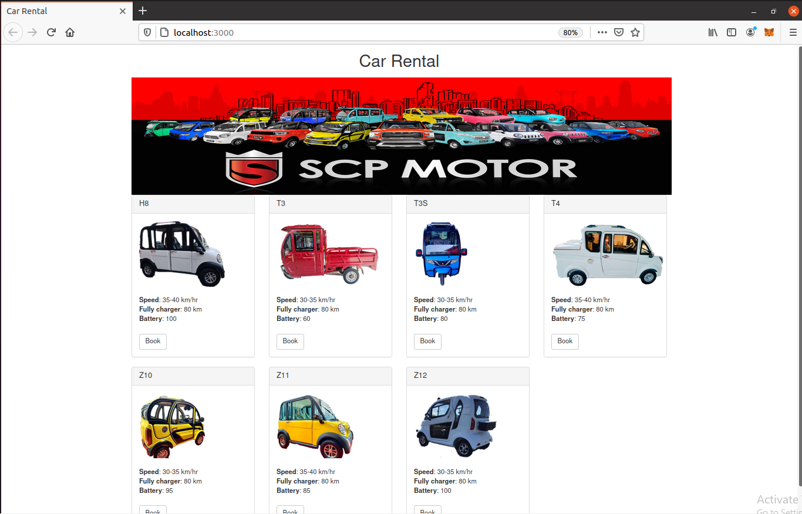

# พัฒนา Web base
โดยใช้โครงสร้าง pet-shop ของ Truffle มาใช้ในการพัฒนา

```
truffle unbox pet-shop
```

ใช้ Visual Studio Code เพื่อสร้างไฟล์ชื่อ Booking.sol ในไดเร็กทอรี contracts โดยมีโค้ดดังนี้

```
  
pragma solidity ^0.5.0;

contract Booking {
    address[7] public bookers;

    function book(uint carId) public returns (uint) {
        require(carId >= 0 && carId <=6);
        bookers[carId] = msg.sender;
        return carId;
    }

    function getBookers() public view returns (address[7] memory) {
        return bookers;
    }
}
```

ทำการ Compile

```
truffle compile
```

ใช้ Visual Studio Code ในการสร้างไฟล์ 2_deploy_contracts.js ในไดเร็กทอรี migrations ดังนี้

``` 
var Booking = artifacts.require("Booking");

module.exports = function(deployer) {
  deployer.deploy(Booking);
};
```

เปิด Ganache และทำการ Migrate

```
truffle migrate
```

ทดสอบ Smart contract
ใช้ Visual Studio Code ในการสร้างไฟล์ TestBooking.sol เพื่อทดสอบ Booking.sol ในไดเร็กทอรี test 

```
pragma solidity ^0.5.0;

import "truffle/Assert.sol";
import "truffle/DeployedAddresses.sol";
import "../contracts/Booking.sol";

contract TestBooking {
  // The address of the Booking contract to be tested
  Booking booking = Booking(DeployedAddresses.Booking());

  // The id of the pet that will be used for testing
  uint expectedCarId = 5;

  //The expected owner of adopted pet is this contract
  address expectedBooker = address(this);

  function testUserCanBookCar() public {
    uint returnedId = booking.book(expectedCarId);
    Assert.equal(returnedId, expectedCarId, "Booking of the expected pet should match what is returned.");
  }

  // Testing retrieval of a single pet's owner
  function testGetBookerAddressByCarId() public {
    address booker = booking.bookers(expectedCarId);
    Assert.equal(booker, expectedBooker, "Booker of the expected pet should be this contract");
  }

  // Testing retrieval of all pet owners
  function testGetBookerAddressByCarIdInArray() public {
    // Store adopters in memory rather than contract's storage
    address[7] memory bookers = booking.getBookers();
    Assert.equal(bookers[expectedCarId], expectedBooker, "Booker of the expected pet should be this contract");
  }
}
```

ทำการ Test

```
truffle test
```

แก้ไฟล์ pets.js เป็นข้อมูลที่จะทำการแสดงบนหน้าเว็บ
ทำการแก้ไขไฟล์ src/index.html และไฟล์ src/js/app.js

Run program

```
npm run dev
```

ผลลัพธ์จากการพัฒนาและแก้ไข

